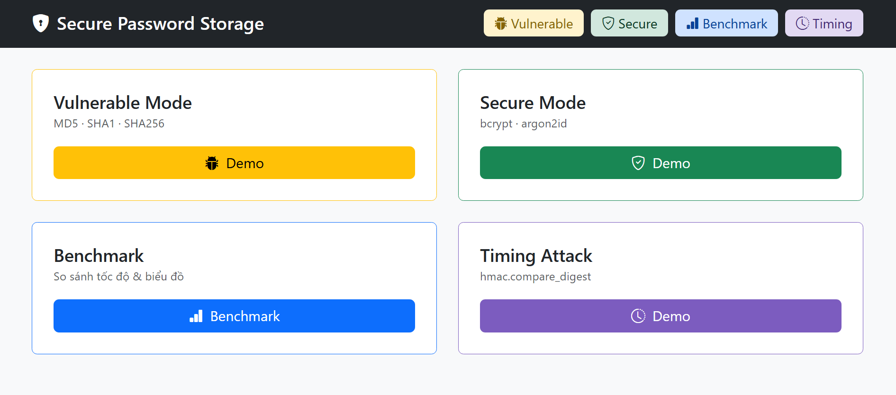
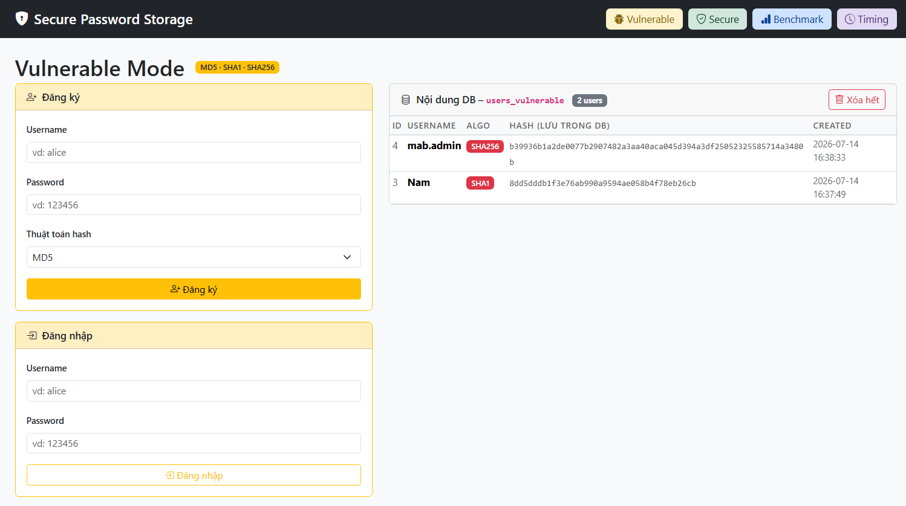
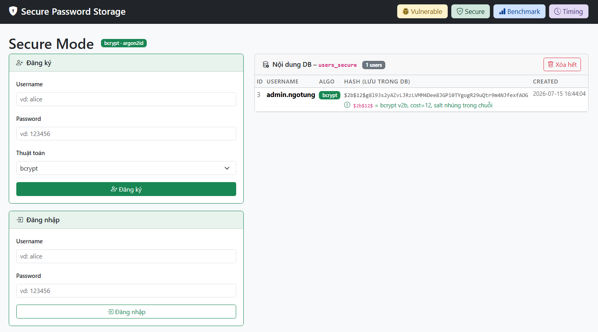
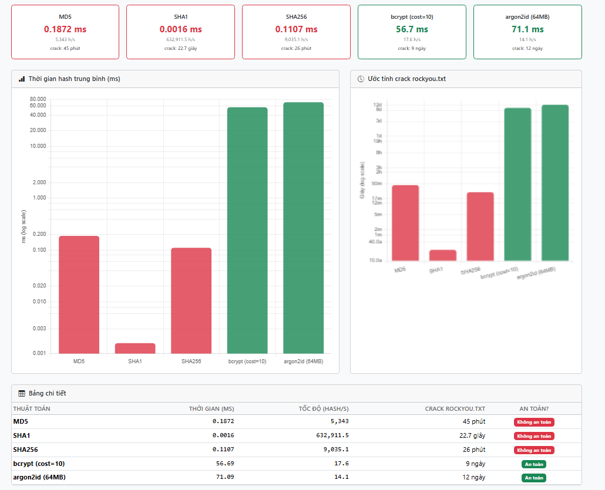
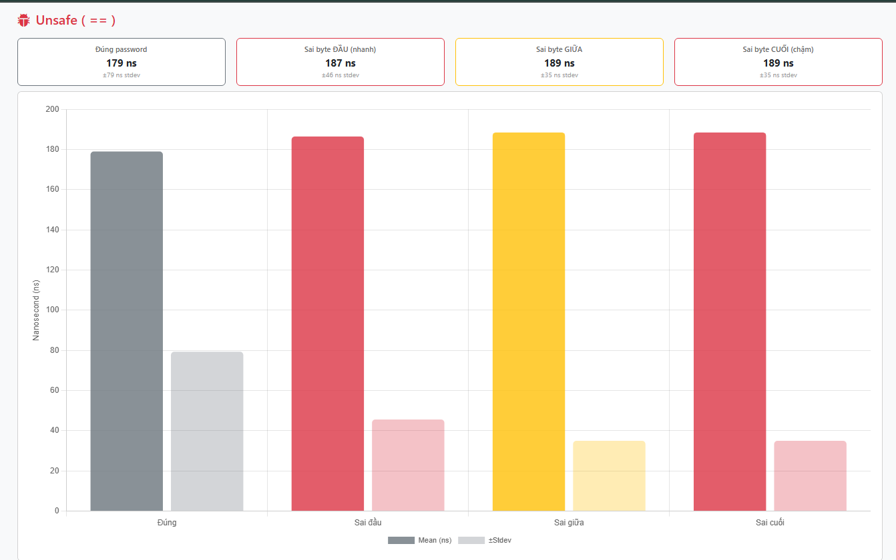
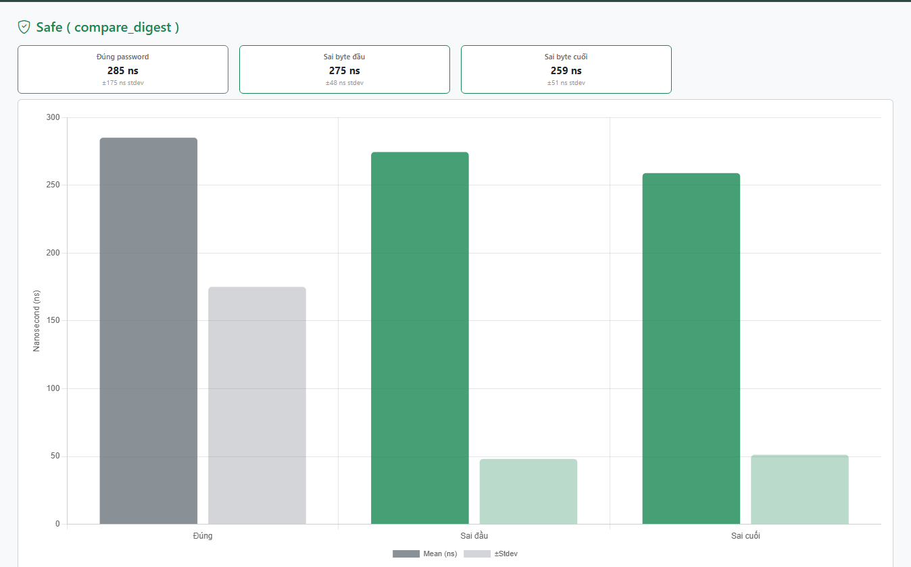

# Nghiên cứu Phương thức Lưu trữ Bảo mật Tài khoản bằng bcrypt, Argon2 và MD5

## Thành viên Nhóm

| Họ và Tên | Email |
|-----------|-------|
| Nhữ Hào Nam | haonam.works@gmail.com |
| Nguyễn Tiến Đạt | dfsushi@gmail.com |
| Lê Thành Đạt | thanhdat312004@gmail.com |
| Võ Hoàng Hiệp | hiep.vh@gmail.com |

---

## Phân chia Công việc

**Nhữ Hào Nam** — Khởi tạo dự án & Vulnerable Mode

Thiết lập cấu trúc Flask, cấu hình SQLite và `init_db()`. Xây dựng layout nền và trang chủ. Triển khai toàn bộ Vulnerable Mode: đăng ký / đăng nhập với MD5, SHA1, SHA256, cố tình không salt để minh hoạ điểm yếu. Thêm `rockyou.txt` phục vụ demo tấn công từ điển.

**Nguyễn Tiến Đạt** — Secure Mode

Tích hợp `bcrypt` và `argon2-cffi`. Xây dựng Secure Mode: đăng ký / đăng nhập với bcrypt (cost=12) và argon2id (memory=64MB, time=2). Thiết kế `secure.html` hiển thị cấu trúc hash nhúng salt và thời gian hash thực đo. Cập nhật `requirements.txt` và mở rộng navbar.

**Lê Thành Đạt** — Crack Demo & Benchmark

Xây dựng `crack_demo.py` mô phỏng tấn công dictionary attack lên cả 4 thuật toán, ước tính thời gian crack rockyou.txt. Xây dựng API `/benchmark/run` và giao diện `benchmark.html` đo tốc độ hash thực tế, vẽ biểu đồ so sánh bằng Chart.js.

**Võ Hoàng Hiệp** — Timing Attack & Hoàn thiện

Xây dựng module Timing Attack: so sánh `str1 == str2` (dừng sớm khi gặp byte khác) vs `hmac.compare_digest` (constant-time), đo 200 mẫu bằng `perf_counter_ns`. Thiết kế `timing.html` với biểu đồ phân phối mean ± stdev. Viết `hash_demo.py` demo độc lập 5 thuật toán. Hoàn thiện `app.py` và `requirements.txt`.

---

## Giới thiệu Đề tài

Phần lớn các vụ rò rỉ dữ liệu thực tế (Adobe 2013 — 153 triệu tài khoản, RockYou 2009 — 32 triệu mật khẩu plaintext) đều xuất phát từ việc lưu mật khẩu bằng các hàm hash tổng quát như MD5, SHA1, SHA256. Các thuật toán này không được thiết kế cho mục đích lưu trữ mật khẩu: tốc độ tính toán quá cao cho phép attacker thử hàng tỷ hash/giây bằng GPU, không có salt khiến cùng mật khẩu luôn cho cùng hash và dễ bị rainbow table, không có work factor nên không thể điều chỉnh độ khó theo phần cứng hiện đại.

Dự án xây dựng ứng dụng web demo để so sánh thực nghiệm:

| | MD5 / SHA1 / SHA256 | bcrypt | Argon2id |
|---|---|---|---|
| Mục đích thiết kế | Hash tổng quát | Password hashing | Password hashing |
| Salt | Không | Tự động nhúng | Tự động nhúng |
| Work factor | Không | Cost 4–31 | time / memory / parallelism |
| Tốc độ thực đo | ~10,000,000 hash/s | ~5 hash/s | ~2 hash/s |
| Crack rockyou.txt | Vài giây | Hàng chục năm | Hàng trăm năm |
| Khuyến nghị | Không dùng | Tốt | Tốt nhất |

Ứng dụng gồm 5 module: Vulnerable Mode, Secure Mode, Crack Demo, Benchmark và Timing Attack.

---

## Hướng dẫn Chạy
 
**Yêu cầu:** Python 3.10 trở lên, Git Bash (nếu dùng Windows)
 
**1. Clone repository**
 
```bash
git clone https://github.com/username/password_security_demo.git
cd password_security_demo
```
 
**2. Tạo virtual environment**
 
```bash
# Windows (Git Bash)
python -m venv venv
source venv/Scripts/activate
 
# Windows (PowerShell / CMD)
python -m venv venv
venv\Scripts\activate
 
# macOS / Linux
python3 -m venv venv
source venv/bin/activate
```
 
Khi kích hoạt thành công, terminal sẽ hiện `(venv)` ở đầu dòng.
 
**3. Cài thư viện**
 
```bash
pip install -r requirements.txt
```
 
 
**4. Chạy ứng dụng**
 
```bash
python app.py
```
 
Mở trình duyệt tại `http://127.0.0.1:5000`.
 
**Script độc lập**
 
```bash
# Demo nhanh 5 thuật toán
python hash_demo.py
 
# Mô phỏng tấn công brute-force với wordlist mặc định (30 password phổ biến)
python crack_demo.py
 
# Dùng rockyou.txt thật (~134MB, tải từ SecLists)
python crack_demo.py --wordlist rockyou.txt
 
# Bật thêm SHA1 attack
python crack_demo.py --all
```
 
File `demo.db` tự tạo khi chạy lần đầu, không commit vào repo. `rockyou.txt` trong repo chỉ là placeholder rỗng, tải bản thật tại [SecLists](https://github.com/danielmiessler/SecLists/blob/master/Passwords/Leaked-Databases/rockyou.txt.tar.gz) nếu cần demo crack thực tế.
 
---

## Kết quả Demo

### Trang chủ


*Trang chủ với 4 module: Vulnerable, Secure, Benchmark, Timing Attack*

---

### Vulnerable Mode


*Hash MD5 lưu thẳng vào DB, không salt. Có link tra cứu trực tiếp trên crackstation.net*

---

### Secure Mode


*Hash bcrypt nhúng salt và cost factor trong chuỗi `$2b$12$...`. Thời gian hash ~200ms*

---

### Benchmark


*Biểu đồ log-scale: MD5 ~0.001ms vs bcrypt ~200ms. Crack time: MD5 = vài giây, bcrypt = hàng nghìn ngày*

---

### Timing Attack


*Unsafe (`==`): sai byte đầu nhanh hơn sai byte cuối ~30ns.*


*Safe (`compare_digest`): thời gian đồng đều.*

## Tài liệu Tham khảo

- [OWASP Password Storage Cheat Sheet](https://cheatsheetseries.owasp.org/cheatsheets/Password_Storage_Cheat_Sheet.html)
- [bcrypt — Niels Provos & David Mazières, 1999](https://www.usenix.org/legacy/events/usenix99/provos/provos.pdf)
- [Argon2 — Password Hashing Competition Winner 2015](https://github.com/P-H-C/phc-winner-argon2)
- [Python argon2-cffi](https://argon2-cffi.readthedocs.io/)
- [Python bcrypt](https://pypi.org/project/bcrypt/)
- [hmac.compare_digest](https://docs.python.org/3/library/hmac.html#hmac.compare_digest)
